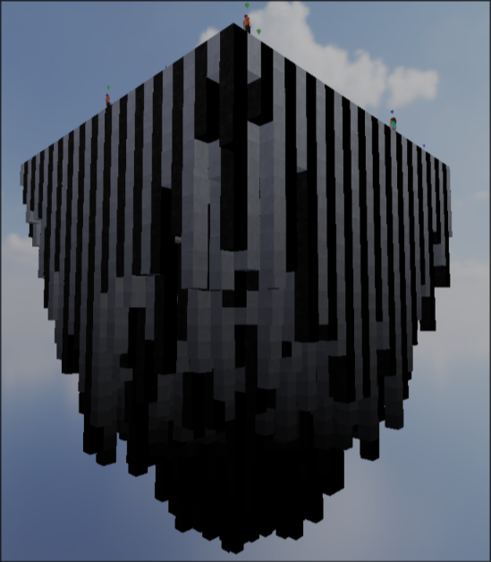
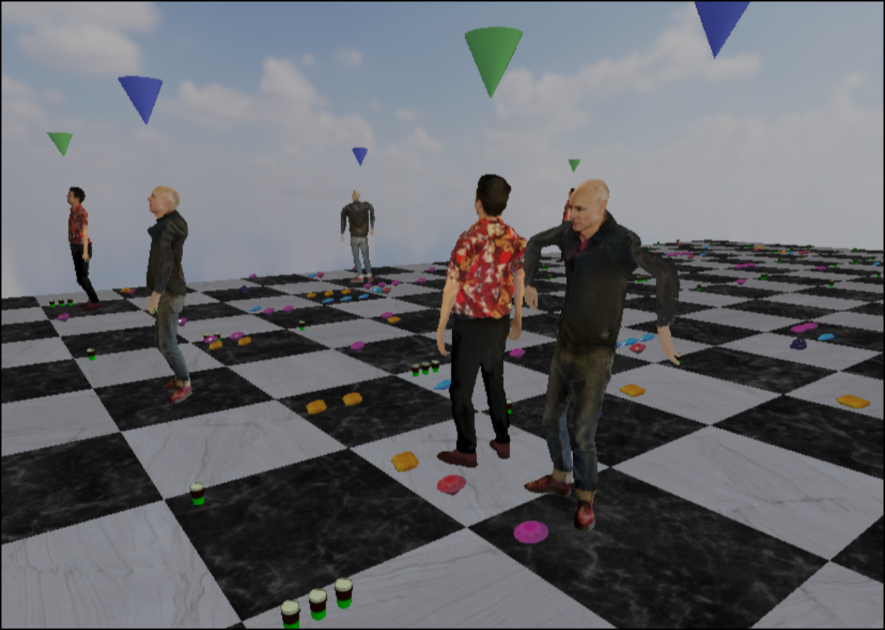
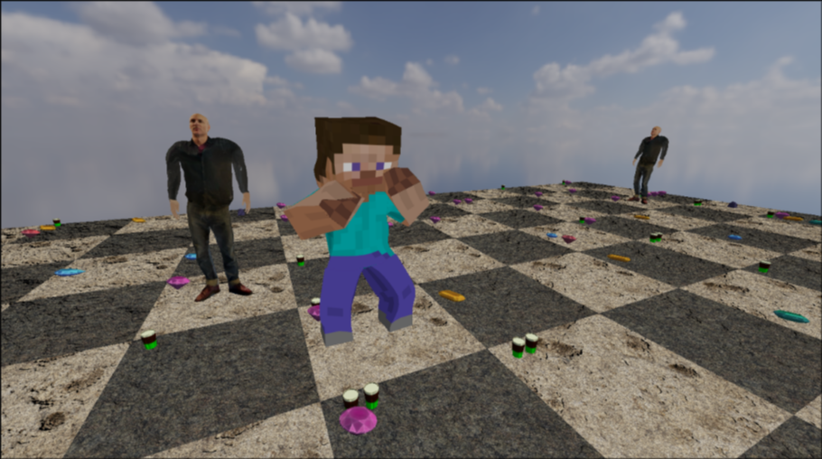
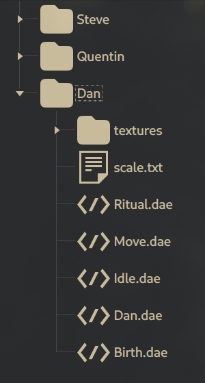

# ZAPPY



## Purpose

The Zappy project is a simulation in which AI agents gather resources on a map
to level up.

To level up, agents need a specific amount of resources at each stage and must be at the same level or higher than other players.

### Technologies Used

This project consists of three components:

1. **Server**: Manages the game logic (**C**)
2. **GUI**: Displays the state of the game (**C++**)
3. **AI Client**: Connects to the server to participate in the game (**Python**)

There are distinct protocols for server-to-GUI communication and server-to-AI communication.

#### Encapsulation

In the GUI, the networking and protocol components are separated from the rendering component.

```cpp
#pragma once

#include <unistd.h>
#include <netinet/in.h>
#include <string>

class NetworkManager {
public:
    NetworkManager(const std::string &address, int port);
    NetworkManager(int port);
    NetworkManager(NetworkManager &&) = delete;
    NetworkManager(const NetworkManager &) = delete;
    NetworkManager &operator=(NetworkManager &&) = delete;
    NetworkManager &operator=(const NetworkManager &) = delete;
    ~NetworkManager();

    bool connectToServer();
    [[nodiscard]] ssize_t sendData(const std::string &data) const;
    [[nodiscard]] ssize_t receiveData(char *buffer, std::size_t size) const;

    [[nodiscard]] int getSocket() const { return _socket; }

private:
    std::string _address;
    int _socket;
    int _port;
    struct sockaddr_in _addr;
};
```

### Modding

You can add any model to the game by following the instructions in the "Modding" section.



#### Procedure for adding a model to Zappy:

1. Find a .glb model online (it should be in a T-pose), for example, on Sketchfab [https://sketchfab.com/].
2. Import the model to a site that converts .glb to .obj ZIP, like this one: [https://imagetostl.com/convert/file/glb/to/obj#convert].
3. Import the ZIP file into Mixamo [https://www.mixamo.com/#/?page=3&query=&type=Character].
4. Download the T-pose model from Mixamo as a .dae file.
5. Choose animations for birth, ritual, idle, and movement.
6. Download the animations with default settings in .dae format.
7. Create a folder with the skin's name in assets/Players.
8. Extract all ZIP files for the animations and the model into this folder.
9. Remove all "textures" files from the animations, keeping only the one from the T-pose model.
10. Rename the T-pose model to "SkinName.dae" (it should match the folder name of the skin).
11. Rename all animation .dae files to Birth, Ritual, Move, and Idle.

should look like this:

